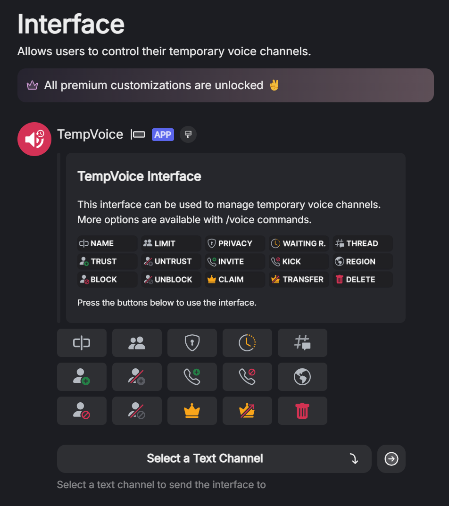

# Customize Interface

## Open the interface preview

[Dashboard](https://tempvoice.xyz/dashboard) -> Select Your Server

<figure><figcaption></figcaption></figure>

## Change avatar and name


As soon you enter a custom avatar or name the interface message will turn into a webhook which allows to apply a custom branding.

If you want to change the avatar and name of the bot itself, you should take a look at [Your Own Bot](your-own-bot.md)


1. Click on the name and enter a new one like this:

<figure><figcaption></figcaption></figure>

2. Click on the avatar and enter an image url. Its important that this url has to store the image permanent. Uploading an image on Discord and using that image link won't be permanent.

<figure><figcaption></figcaption></figure>

## This is how it could look like

<figure><figcaption></figcaption></figure>
