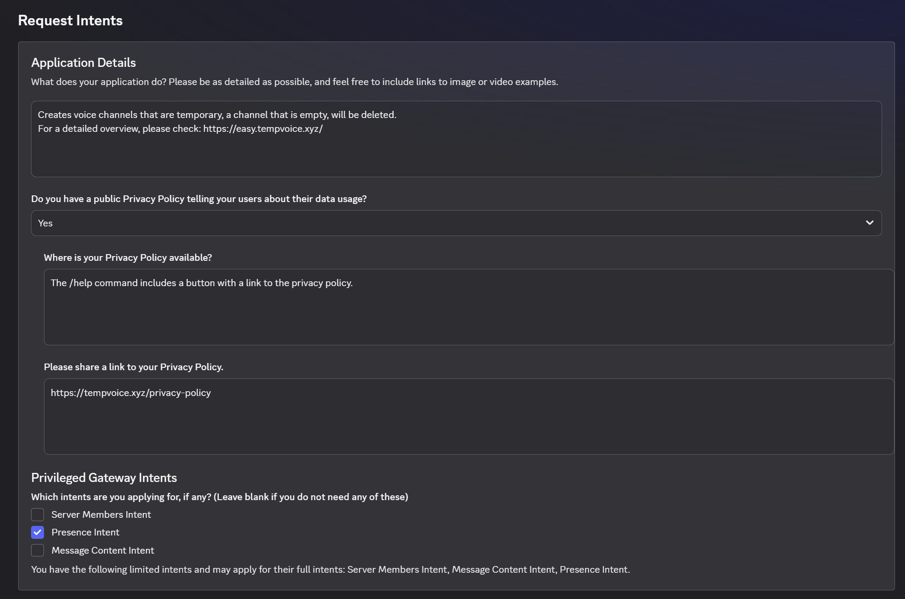

# Customize Interface

Visit the [TempVoice Dashboard](https://tempvoice.xyz/dashboard), login with your Discord account, select your Discord server and you will see the **Interface Preview.**

This interactive preview lets you directly edit the interface. Play around with it!

<figure><figcaption></figcaption></figure>

***

This example changed the avatar, name, title, description, footer text and the order of buttons, it's also possible to remove them by clicking on them once.

<figure><figcaption></figcaption></figure>
